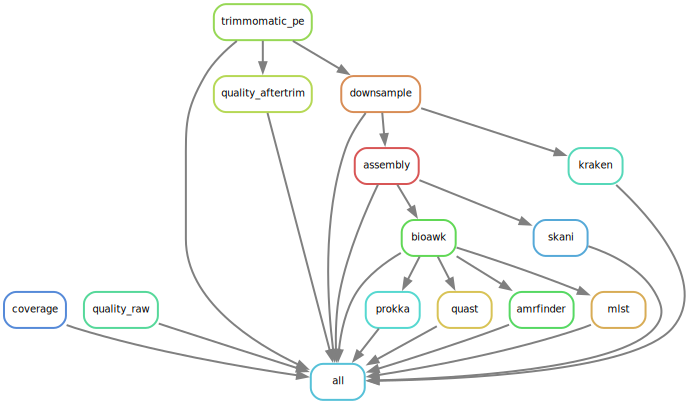
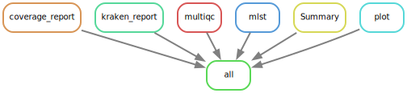

# QCD - Quality Control and Contamination Detection workflow.

QCD is a smakemake worflow for microbial illumina sequencing quality control and contamination detection. As a SOP part of Snitkin lab, this pipeline should be run on raw sequencing data as soon as the data is available from the sequencing core department. Apart from QCing raw sequencing data, it performs numerous downstream tasks such as AMR gene detection, SPAdes genome assembly, MLST detection and Assembly annotation. 

## Installation

> Clone the github directory onto your system.

```
git clone https://github.com/alipirani88/QCD_SMAKE.git

```
> Create QCD conda environment

```
conda env create -f QCD.yaml -n QCD
```

> Change snakemake configuration settings in config/config.yaml file and create a new sample list file - sample_test.tsv


## Quick start

### Run QCD on a set of samples.

```
$ snakemake -s QCD.smk -p --use-conda -j 999 --cluster "sbatch -A {cluster.account} -p {cluster.partition} -N {cluster.nodes}  -t {cluster.walltime} -c {cluster.procs} --mem-per-cpu {cluster.pmem}" --conda-frontend conda --cluster-config config/cluster.json --configfile config/config.yaml --latency-wait 1000
```



### Gather Summary files and generate a report. 
```
$ snakemake -s QCD_report.smk -p --configfile config/config.yaml
```


## Dependencies

### Near Essential
* [Snakemake>6.15.5](https://snakemake.readthedocs.io/en/stable/#)
* [Conda](https://docs.conda.io/en/latest/)

All the necessary software stack required for the workflow will be installed using conda package manager.

### Tool stack used in workflow

* [fastq-scan](https://github.com/rpetit3/fastq-scan)
* [Trimmomatic](http://www.usadellab.org/cms/?page=trimmomatic)
* [SPades](https://github.com/ablab/spades)
* [AMRFinderPlus](https://github.com/ncbi/amr)
* [bioawk](https://github.com/lh3/bioawk)
* [Prokka](https://github.com/tseemann/prokka)
* [mlst](https://github.com/tseemann/mlst)
* [FastQC](https://www.bioinformatics.babraham.ac.uk/projects/fastqc/)
* [MultiQC](https://multiqc.info/)
* [Pandas](https://pandas.pydata.org/)
* [Matplotlib](https://matplotlib.org/)
