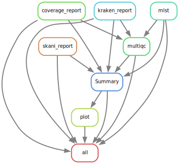

# QCD - Quality Control and Contamination Detection workflow.

QCD is a workflow for microbial Illumina sequencing quality control and contamination detection implemented in Snakemake.

### Summary

As part of the SOP in the [Snitkin lab](https://thesnitkinlab.com/index.php), this pipeline should be run on raw sequencing data as soon as the data is available from the sequencing core department. 

In short, it performs the following steps:

* [Fastqc](https://github.com/s-andrews/FastQC) is used to generate HTML reports to asses quality of sequencing reads before and after trimming reads. 
* Trims and filters low-quality bases and adapter sequences from raw FASTQ reads using [Trimmomatic](https://github.com/usadellab/Trimmomatic).
* [fastq-scan](https://github.com/rpetit3/fastq-scan) is used to estimate genome coverage of FASTQ files.
* Assembles trimmed reads into contigs using [SPAdes](https://github.com/ablab/spades).
* [Kraken2](https://github.com/DerrickWood/kraken2) is used to provide detailed reports on the taxonomic composition of the trimmed raw reads.
* The assembled contigs from [SPAdes](https://github.com/ablab/spades) is then passed through [Prokka](https://github.com/tseemann/prokka) for annotation, [QUAST](https://quast.sourceforge.net/) for assembly statistics, [MLST](https://github.com/tseemann/mlst) for determining sequence type based on sequences of housekeeping genes, [AMRFinderPlus](https://github.com/ncbi/amr) to identify antimicrobial resistance genes, [skani](https://github.com/bluenote-1577/skani) to identify closest reference genome and [BUSCO](https://busco.ezlab.org/) for assembly completeness statistics.
* [Multiqc](https://github.com/MultiQC/MultiQC) aggregates the final outputs from [Fastqc](https://github.com/s-andrews/FastQC), [Kraken2](https://github.com/DerrickWood/kraken2) , [Prokka](https://github.com/tseemann/prokka) and [QUAST](https://quast.sourceforge.net/) to produce a HTML report

The workflow generates all the output in the output prefix folder set in the config file (instructions on setup found [below](#config)). Each workflow steps gets its own individual folder as shown:

```
results/2024-05-21_QCD_Project_MDHHS/
|—— sample_name
|   ├── amrfinder
|   ├── downsample
|   ├── kraken
|   ├── mlst
|   ├── prokka
|   ├── quality_aftertrim
|   ├── quality_raw
|   ├── quast
|   ├── raw_coverage
|   ├── spades
|   └── trimmomatic
└── another_sample_name
```


## Installation 


> If you are using Great Lakes HPC, ensure you are cloning the repository in your scratch directory. Change `your_uniqname` to your uniqname. 

```

cd /scratch/esnitkin_root/esnitkin1/your_uniqname/

```

> Clone the github directory onto your system. 

```

git clone https://github.com/Snitkin-Lab-Umich/QCD.git

```

> Ensure you have successfully cloned QCD. Type `ls` and you should see the newly created directory **_QCD_**. Move to the newly created directory.

```

cd QCD

```

> Load Bioinformatics, snakemake and singularity modules from Great Lakes modules.

```

module load Bioinformatics snakemake singularity

```
<!--
```

module load snakemake singularity

```
-->

This workflow makes use of singularity containers available through [State Public Health Bioinformatics group](https://github.com/StaPH-B/docker-builds). If you are working on Great Lakes (umich cluster)—you can load snakemake and singularity modules as shown above. However, if you are running it on your local or other computing platform, ensure you have snakemake and singularity installed.


## Setup config, samples and cluster files

**_If you are just testing this pipeline, the config and sample files are already loaded with test data, so you do not need to make any additional changes to them. However, it is a good idea to change the prefix (name of your output folder) in the config file to give you an idea of what variables need to be modified when running your own samples on QCD._**

### Config
As an input, the snakemake file takes a config file where you can set the path to `sample.tsv`, path to your raw sequencing reads, path to adapter fasta file etc. Instructions on how to modify `config/config.yaml` is found in `config.yaml`. 

### Samples
Add samples to `config/sample.tsv` following the explanation provided below. `sample.tsv` should be a comma seperated file consisting of two columns—`sample_id` and `illumina_r1`.

* `sample_id` is the prefix that should be extracted from your FASTQ reads. For example, in  your raw FASTQ files directory, if you have a file called `Rush_KPC_110_R1.fastq.gz`, your sample_id would be `Rush_KPC_110`.

* `illumina_r1` is the name of the entire raw FASTQ file. In the same directory,  if your file is called `Rush_KPC_110_R1.fastq.gz`, your sample_id would be `Rush_KPC_110_R1.fastq.gz`. **_Only include forward reads._**

You can create sample.tsv file using the following for loop. Replace *path_to_your_raw_reads* below with the actual path to your raw sequencing reads.

```

echo "sample_id,illumina_r1" > config/sample.tsv

for read1 in path_to_your_raw_reads/*_R1.fastq.gz; do
    sample_id=$(basename $read1 | sed 's/_R1.fastq.gz//g')
    read1_basename=$(basename $read1)
    echo $sample_id,$read1_basename
done >> config/sample.tsv

```

### Cluster file

Reduce the walltime (to ~6 hours) in `config/cluster.json` to ensure the jobs are being submitted in a timely manner. 

## Quick start

### Run QCD on a set of samples.

> Preview the steps in QCD by performing a dryrun of the pipeline. 

```

snakemake -s QCD.smk --dryrun -p

```

> Run QCD locally

```

snakemake -s QCD.smk -p --configfile config/config.yaml --cores all

```

>Run QCD on Great lakes HPC

```

snakemake -s QCD.smk -p --use-conda --use-singularity --use-envmodules -j 999 --cluster "sbatch -A {cluster.account} -p {cluster.partition} -N {cluster.nodes}  -t {cluster.walltime} -c {cluster.procs} --mem-per-cpu {cluster.pmem} --output=slurm_out/slurm-%j.out" --conda-frontend conda --cluster-config config/cluster.json --configfile config/config.yaml --latency-wait 1000 --nolock

```
> Submit QCD as a batch job (_coming soon!_)


<!--
### Gather Summary files and generate a report. 

>Start an interactive session in your current directory i.e. `QCD`.

```

srun --account=esnitkin1 --nodes=1 --ntasks-per-node=1 --mem-per-cpu=5GB --cpus-per-task=1 --time=12:00:00 --pty /bin/bash

```

> Preview the steps in QCD report by performing a dryrun of the pipeline. 

```

snakemake -s QCD_report.smk --dryrun -p

```
> Run QCD report on Great lakes HPC

```

snakemake -s QCD_report.smk -p --use-singularity --cores 2

```

-->
## Dependencies

### Near Essential
* [Snakemake>=7.32.4](https://snakemake.readthedocs.io/en/stable/#)
* [Conda](https://docs.conda.io/en/latest/)

<!--All the necessary software stack required for the workflow will be installed using conda package manager.-->

### Tool stack used in workflow

* [fastq-scan](https://github.com/rpetit3/fastq-scan)
* [Trimmomatic](http://www.usadellab.org/cms/?page=trimmomatic)
* [SPades](https://github.com/ablab/spades)
* [AMRFinderPlus](https://github.com/ncbi/amr)
* [bioawk](https://github.com/lh3/bioawk)
* [Prokka](https://github.com/tseemann/prokka)
* [mlst](https://github.com/tseemann/mlst)
* [FastQC](https://www.bioinformatics.babraham.ac.uk/projects/fastqc/)
* [MultiQC](https://multiqc.info/)
* [Pandas](https://pandas.pydata.org/)
* [Matplotlib](https://matplotlib.org/)
